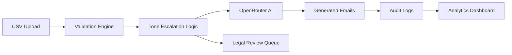

<div align="center">


# ✨ FinFlow AI

### Intelligent Finance Workflow Automation Platform

AI-powered payment recovery, escalation management, analytics intelligence, and enterprise-grade audit visibility.

<br/>


<br/>


</div>

---

# 📌 Project Overview

FinFlow AI is a modern AI-powered finance automation platform designed to streamline overdue payment recovery workflows using intelligent escalation systems and AI-generated finance communication.

The platform simulates a production-inspired enterprise receivables workspace featuring:

* CSV invoice ingestion
* AI-powered follow-up email generation
* Escalation-aware finance workflows
* Legal review queue management
* Analytics dashboards
* Persistent workspace state
* Audit trail monitoring
* Security and compliance visibility

The project was built as an AI internship evaluation prototype with a focus on:

* enterprise-grade UI/UX
* realistic workflow automation
* AI integration
* finance operations visibility
* recruiter-ready presentation quality

---

# ✨ Platform Highlights

| Feature                  | Description                                                |
| ------------------------ | ---------------------------------------------------------- |
| 🤖 AI Email Generation   | Dynamic finance follow-up generation using OpenRouter AI   |
| 📈 Analytics Dashboard   | Real-time overdue tracking and financial intelligence      |
| ⚠ Legal Escalation Queue | Automatic blocking for invoices above escalation threshold |
| 🧾 Audit Trail           | Searchable finance monitoring and activity timeline        |
| 💾 Persistent Workspace  | Local state persistence after browser refresh              |
| 🔒 Security Controls     | Dry-run mode and prompt safety protections                 |
| 📂 CSV Ingestion         | Upload and process realistic finance invoice datasets      |
| 📊 Operational Insights  | AI-powered analytics and escalation intelligence           |

---

# 🏗 Architecture



---

# ⚙ AI Workflow

1. Finance operator uploads invoice CSV records
2. Invoice data is normalized and validated
3. Escalation engine classifies overdue stages
4. OpenRouter AI generates contextual follow-up emails
5. Legal escalation queue blocks high-risk invoices
6. Audit events are logged automatically
7. Analytics dashboards update dynamically
8. Workspace state persists after refresh

---

# 🧠 Tone Escalation Engine

| Overdue Days | Communication Tone | Workflow Action                     |
| ------------ | ------------------ | ----------------------------------- |
| 1–7 Days     | Warm & Friendly    | Gentle payment reminder             |
| 8–14 Days    | Polite but Firm    | Professional follow-up              |
| 15–21 Days   | Formal & Serious   | Escalated recovery communication    |
| 22–30 Days   | Stern & Urgent     | High-priority payment request       |
| 30+ Days     | Legal Escalation   | AI generation blocked and escalated |

---

# 🛠 Technical Stack & Decision Log

## Frontend

* React.js
* Vite
* Tailwind CSS
* Framer Motion
* Recharts
* React Router
* React Icons
* Axios

## Backend

* Node.js
* Express.js
* Multer
* csv-parser
* dotenv
* Axios

## AI Integration

* OpenRouter API
* Gemini 2.0 Flash

## Key Technical Decisions

* Local persistence was selected to keep the prototype stateful without infrastructure overhead
* AI generation is routed through backend APIs to protect API credentials
* Dry-run mode is permanently enabled for safe demonstration
* Realistic seed data is used to make the workspace feel production-inspired immediately
* The UI was refined into a modern enterprise SaaS direction instead of overcomplicated redesigns

---

# 🔒 Security & Compliance

FinFlow AI includes multiple security and governance considerations:

| Risk                        | Mitigation                    |
| --------------------------- | ----------------------------- |
| Prompt Injection            | Controlled structured prompts |
| API Key Exposure            | `.env` isolation              |
| Hallucination Risk          | Context-aware prompt design   |
| Unauthorized Email Delivery | Dry-run mode enabled          |
| PII Exposure                | Local-only persistence        |
| Escalation Abuse            | Legal queue enforcement       |

Additional safeguards:

* No SMTP integration enabled
* No external database storage
* Audit trail persistence
* Controlled AI workflow boundaries

---

# 💾 Persistent Workspace System

The application preserves workspace state using browser persistence.

Persisted data includes:

* uploaded invoices
* generated emails
* analytics
* audit logs
* notifications
* escalation queue
* dashboard metrics

Refreshing the browser does NOT clear the workspace.

---

# 📂 Folder Structure

```text
FinFlow-AI/
├── client/
│   ├── public/
│   └── src/
│       ├── assets/
│       ├── components/
│       ├── layouts/
│       ├── pages/
│       ├── services/
│       ├── utils/
│       └── App.jsx
│
├── server/
│   ├── routes/
│   ├── services/
│   ├── middleware/
│   ├── uploads/
│   └── server.js
│
├── sample-data/
├── sample-output/
├── README.md
└── .env.example
```

---

# 📊 Platform Showcase

# 📈 Executive Dashboard

A centralized AI-powered finance command center providing:

* real-time invoice analytics
* escalation monitoring
* payment recovery visibility
* workflow intelligence
* operational tracking

<div align="center">
  
</div>

---

# 📂 Invoice Upload Workspace

A modern CSV ingestion workspace supporting:

* invoice validation
* automated parsing
* finance workflow onboarding
* upload analytics
* dynamic processing

<div align="center">
  
</div>

---

# 🤖 AI Email Generation Engine

An AI-powered communication workspace generating:

* personalized reminders
* escalation-aware emails
* tone-adaptive communication
* legal escalation notices

Powered using OpenRouter + Gemini AI.

<div align="center">
  
</div>

---

# 📊 Analytics & Financial Intelligence

Interactive analytics dashboards provide:

* overdue distribution analysis
* exposure tracking
* escalation intelligence
* payment workflow metrics
* finance operational insights

<div align="center">
  
</div>

---

# 🔒 Security & Audit Compliance

Enterprise-inspired audit visibility featuring:

* dry-run protection
* audit trail persistence
* escalation governance
* AI monitoring visibility
* compliance-focused workflows

<div align="center">
  
</div>

---

# 🎬 Demo Workflow

1. Upload invoice CSV records
2. AI classifies overdue stages
3. Escalation engine determines communication tone
4. OpenRouter AI generates finance emails
5. Legal escalation queue blocks high-risk accounts
6. Audit logs capture workflow activity
7. Analytics update dynamically
8. Workspace state persists after refresh

---

# ✅ Assignment Requirement Coverage

| Requirement                       | Status        |
| --------------------------------- | ------------- |
| CSV Invoice Ingestion             | ✅ Implemented |
| AI Email Generation               | ✅ Implemented |
| Tone Escalation Logic             | ✅ Implemented |
| Audit Trail Logging               | ✅ Implemented |
| Legal Escalation Queue            | ✅ Implemented |
| Dry-Run Safety Mode               | ✅ Implemented |
| Security Mitigation Documentation | ✅ Implemented |
| Architecture Diagram              | ✅ Implemented |
| Persistent Workspace State        | ✅ Implemented |
| Analytics Dashboard               | ✅ Implemented |

---

# 📦 Sample Output Bundle

The project includes:

* generated email examples
* audit log exports
* sample CSV datasets
* dashboard screenshots
* analytics artifacts

Located inside:

```text
sample-output/
```

---

# 🌐 Deployment Ready

The architecture supports deployment on:

* Vercel
* Render
* Railway
* Dockerized environments
* SaaS hosting platforms

---

# ⚡ Setup Instructions

## Backend Setup

```bash
cd server
npm install
```

Create:

```env
server/.env
```

Add:

```env
PORT=5000
OPENROUTER_API_KEY=your_openrouter_api_key
OPENROUTER_MODEL=google/gemini-2.0-flash-exp:free
```

Run backend:

```bash
npm start
```

---

## Frontend Setup

```bash
cd client
npm install
npm run dev
```

Open:

```text
http://localhost:5173
```

---

# 📁 Sample CSV Format

```csv
invoice_no,client_name,amount,due_date,email,days_overdue
INV-001,Rajesh Sharma,45000,2026-04-25,rajesh@company.in,12
```

---

# 🚀 Future Enhancements

* SMTP email delivery integration
* CRM integrations
* Multi-user workspaces
* Role-based access control
* AI payment forecasting
* Predictive risk scoring
* Multi-agent orchestration
* Cloud-native persistence
* Real-time notification center

---

# 📝 Notes

* This project is designed as a production-inspired AI finance prototype
* Dry-run mode intentionally prevents real email delivery
* OpenRouter API integration powers AI generation workflows
* Seeded invoice data allows instant demo readiness
* Workspace reset restores the default demo environment

---

<div align="center">

# 💡 FinFlow AI

### AI-Powered • Enterprise-Inspired • Finance Automation SaaS

Built for AI Internship Evaluation • Modern SaaS Prototype • Intelligent Workflow Automation

</div>
