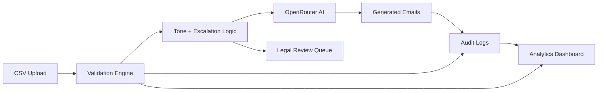

<div align="center">
  
  <h1>FinFlow AI</h1>
  <p><strong>Enterprise AI receivables workspace</strong></p>
</div>

FinFlow AI is a polished AI finance SaaS prototype for receivables operations. It is built to feel like a real enterprise product: invoices persist after refresh, AI-generated emails stay in the vault, audit events are searchable, and legal escalation is visibly blocked when invoices cross the recovery threshold.

## Project Overview

The application demonstrates an end-to-end finance workflow:

- CSV invoice ingestion
- AI follow-up email generation
- Legal escalation controls
- Audit trail monitoring
- Analytics and risk visibility
- Persistent workspace state
- Downloadable sample data for demos and grading

The UI keeps the existing clean enterprise direction. The final pass focused on making the product feel complete, stateful, and submission-ready rather than redesigning the interface from scratch.

## Key Features

- Persistent invoices, generated emails, audit logs, and notifications via browser storage
- Realistic seeded workspace with 10 invoices across multiple overdue stages
- Dedicated legal review queue for invoices over 30 days overdue
- AI email workspace with preview modal, copy actions, export, and locked legal generation
- Live search across invoices, clients, emails, and audit logs
- Monitoring-style audit trail with search, filters, timeline feed, and CSV export
- Animated Recharts-based analytics derived directly from invoice data
- Security page covering dry-run mode, prompt injection mitigation, PII handling, and API key isolation
- Downloadable sample CSV for fast testing and assignment review

## Architecture



### Workflow Notes

- Uploads are normalized into the same invoice model as the seed data.
- Legal escalation is blocked at the UI level when days overdue exceed 30.
- AI email output is stored locally so the workspace survives refresh.
- Audit logs and notifications are derived from persisted local state and remain visible after reload.
- Analytics charts are driven from invoice data, so charts stay populated even without a remote fetch.

## AI Workflow

1. A finance operator uploads a CSV or starts from the seeded demo data.
2. The upload is normalized into overdue stages and escalation metadata.
3. The email workspace routes eligible invoices to OpenRouter through the backend.
4. Legal invoices are blocked from generation and routed to the review queue.
5. Generated payloads are added to the email vault and persisted locally.
6. Each action is written to the audit trail for monitoring and export.

## Technical Stack & Decision Log

### Frontend

- React 19
- Vite 8
- Tailwind CSS 4
- Framer Motion
- Recharts
- React Router
- React Icons
- Axios

### Backend

- Node.js / Express
- Multer
- csv-parser
- dotenv
- Axios
- OpenRouter API

### Design Decisions

- Local storage persistence was chosen for the final prototype to keep the workspace stateful without adding infrastructure.
- The UI was kept on the existing modern enterprise direction instead of another redesign.
- Seeded content was expanded so the app opens with believable financial data immediately.
- The AI model is routed through the backend to keep API credentials off the client.
- Dry-run mode is always visible so the prototype remains safe and honest about email behavior.

## Persistence System

Persistent state includes:

- uploaded invoices
- generated emails
- audit logs
- legal review queue visibility
- notifications derived from audit activity
- dashboard metrics derived from the persisted workspace

The app stores this state in `localStorage`, which means refreshes do not clear the workspace. The user can also reset the workspace from the profile menu to restore the seeded demo state.

## Security & Compliance

The final update includes a dedicated security posture for the assignment:

- API keys stay on the server and are never sent to the browser
- Dry-run mode is visible throughout the app
- Prompt injection risk is reduced by controlled prompt assembly
- PII exposure is reduced by keeping data within the demo workspace and audit trail
- Legal escalation is blocked for invoices above the threshold
- Audit events are persisted locally and exportable for review
- Security, governance, and compliance messaging are centralized on the security page

## Sample CSV Download

Use the `Download sample CSV` action on the upload page to export a realistic invoice dataset containing:

- `invoice_no`
- `client_name`
- `amount`
- `due_date`
- `email`
- `days_overdue`

This makes the demo easy to exercise without needing to build a file manually.

## Folder Structure

```text
FinFlow AI/
├── client/
│   ├── public/
│   │   └── favicon.svg
│   └── src/
│       ├── components/
│       ├── data/
│       ├── layouts/
│       ├── pages/
│       ├── services/
│       ├── utils/
│       ├── App.jsx
│       └── index.css
├── server/
│   ├── routes/
│   ├── services/
│   ├── middleware/
│   ├── uploads/
│   └── server.js
├── sample.csv
└── sample-output/
```

## Sample Outputs

The submission bundle includes a `sample-output/` directory for demo artifacts such as:

- `generated-emails.pdf`
- `audit-log.csv`
- dashboard screenshot assets

These artifacts mirror the finished UI and are meant to support assignment review alongside the live app.

## Frontend Workspace

The client app lives in `client/` and contains the full browser experience:

- `src/App.jsx` handles authentication, workspace persistence, and routing.
- `src/layouts/MainLayout.jsx` provides the shell, top bar, notifications, and profile menu.
- `src/pages/DashboardPage.jsx` surfaces the operational summary.
- `src/pages/UploadPage.jsx` handles CSV ingestion and workspace resets.
- `src/pages/EmailsPage.jsx` manages AI email generation, legal holds, and exports.
- `src/pages/AnalyticsPage.jsx` renders data-driven financial pattern analysis.
- `src/pages/AuditPage.jsx` exposes the searchable compliance timeline.
- `src/pages/SecurityPage.jsx` explains dry-run safety, prompt control, and API isolation.

The branded logo used in the interface is shared in the client bundle and is reused at the top of this document.

## Sample Output Bundle

The `sample-output/` directory contains submission artifacts packaged from the finished prototype:

- `generated-emails.pdf` - sample PDF export of generated follow-up emails
- `audit-log.csv` - exported audit trail sample
- `dashboard-home.svg` - dashboard screenshot-style artifact
- `dashboard-analytics.svg` - analytics screenshot-style artifact

The visuals are SVG-based submission assets so the bundle remains lightweight and easy to review in the workspace.

## Screenshots

Add the final browser captures here for submission review:

- Dashboard
- Upload workspace
- Email generation vault
- Analytics
- Audit trail
- Security page

  
  
  
  
  
  

## Setup

### Requirements

- Node.js 18 or newer
- npm
- OpenRouter API key for AI generation

### Backend

```bash
cd server
npm install
```

Create `server/.env`:

```env
PORT=5000
OPENROUTER_API_KEY=your_openrouter_key_here
OPENROUTER_MODEL=~google/gemini-flash-latest
```

Start the backend:

```bash
npm start
```

### Frontend

```bash
cd client
npm install
npm run dev
```

Open the app at `http://localhost:5173`.

## Default Demo State

If no uploaded CSV exists, FinFlow AI preloads a realistic finance workspace with:

- 10 invoice records
- multiple overdue stages
- generated email examples
- audit logs and escalation history
- analytics already populated

This ensures the prototype feels alive immediately, even before the first upload.

## Future Scope

- Multi-user workspaces
- Role-based access control
- Server-backed persistence
- Notification center with live subscriptions
- PDF export for board reporting
- Command palette for faster operator workflows

## Notes

- The app is intended as a polished assignment prototype, not a live receivables system.
- The backend AI model is configured in `server/.env`.
- The workspace reset action restores the seeded demo state from the profile menu.
- Dry-run mode is intentional and should remain visible in the UI.

---

FinFlow AI is now positioned as a recruiter-ready submission: stateful, realistic, and complete enough to present as a production-inspired finance SaaS prototype.
